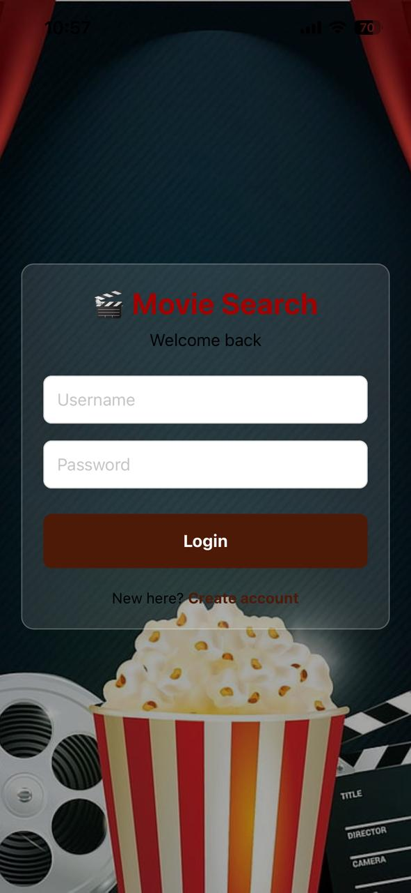
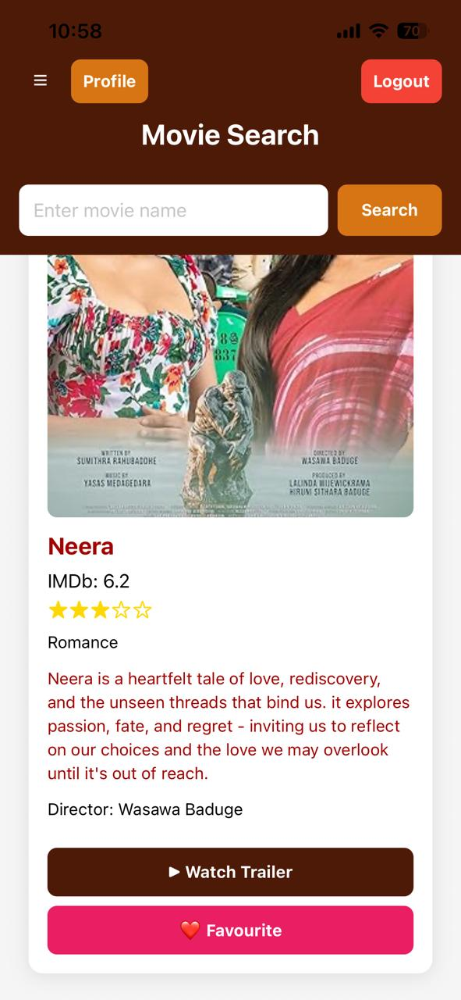
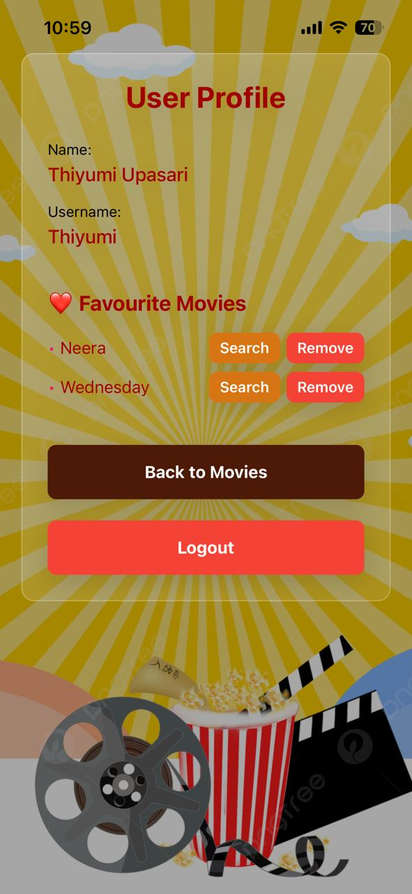

# Movie Search Mobile App

A React Native mobile application built with Expo for searching movies and managing favorites.




## Features

### Core
- User authentication (Login/Register)
- Search movies using OMDB API
- View movie details (poster, rating, plot, director, genre, etc.)
- Add movies to favorites
- User profile with favorite movies list
- Watch movie trailers on YouTube
- Generate IMDb star ratings (1-5 stars)

### Categories & Discovery
- Pre-defined movie categories (Popular, Romance, Classic, Comedy, Young Adult)
- Recommended movies by category
- Left-side collapsible menu for category selection
- Smart display: Shows category recommendations first, search results first after search

### UI/UX
- Glass-morphism card design with gradients
- Responsive sidebar navigation
- Error messages and user alerts
- Loading indicators during API calls

## Prerequisites

- Node.js (v14 or higher)
- npm or yarn
- Expo CLI
- Expo Go app on your mobile device (for testing)

## Installation

1. Install dependencies:
```bash
npm install
```

2. Install Expo CLI globally (if not already installed):
```bash
npm install -g expo-cli
```

## Running the App

1. Start the development server with Tunnel mode (recommended for mobile testing):
```bash
npx expo start --tunnel
```

Or standard mode:
```bash
npm start
```
or
```bash
expo start
```

2. Scan the QR code with:
   - **iOS**: Use the Camera app
   - **Android**: Use the Expo Go app

## How to Use

### Home Screen
1. **Menu Button (☰)**: Click to open category sidebar
2. **Select Category**: Choose from Popular, Romance, Classic, Comedy, or Young Adult
3. **Search**: Enter a movie name and tap Search
4. **Actions**: 
   - ▶ Watch Trailer: Opens YouTube search for the movie trailer
   - ❤️ Favourite: Adds movie to your favorites (must be logged in)

### Profile
- View your favorite movies
- Remove movies from favorites
- Search directly from a favorite movie

### Authentication
- Register a new account with email and password
- Login with credentials
- Logout from the app

## Build for Production

### Android APK
```bash
expo build:android
```

### iOS
```bash
expo build:ios
```

## Technologies Used

- React Native 0.74
- Expo SDK 54
- React Navigation (Stack & Tab)
- AsyncStorage (local data persistence)
- expo-linear-gradient (glass-morphism UI)
- OMDB API (movie database)

## Supported Platforms

- iOS 13+
- Android 6.0+

## Data Persistence

User data is stored locally using AsyncStorage:
- User credentials (email, password)
- Favorite movies list
- User profile information

Data is never sent to external servers and remains on the user's device.

## API Key

The app uses OMDB API for fetching movie data. The API key is included in the code:
- API Key: `d5a82b51`
- Get your own free API key at [http://www.omdbapi.com/](http://www.omdbapi.com/)

## Future Features

- Watchlist (mark as "Watch Later")
- User ratings & personal notes per movie
- Offline movie card caching
- Advanced search with filters (by year, rating, genre)
- Recently viewed movies
- Dark/light theme toggle
- Movie sharing via social media
- Cloud sync for user data

## Troubleshooting

### App won't start
- Clear Expo cache: `expo start -c`
- Reinstall dependencies: `rm -rf node_modules && npm install`
- Check Node.js version: `node --version` (should be v14+)

### API errors
- Verify internet connection
- Check OMDB API key is valid
- Some movie titles may not exist in OMDB database

### AsyncStorage not persisting
- Clear app cache and reinstall
- On Android: Settings > Apps > Movie Search > Storage > Clear Data
- On iOS: Delete and reinstall the app

## License

MIT
